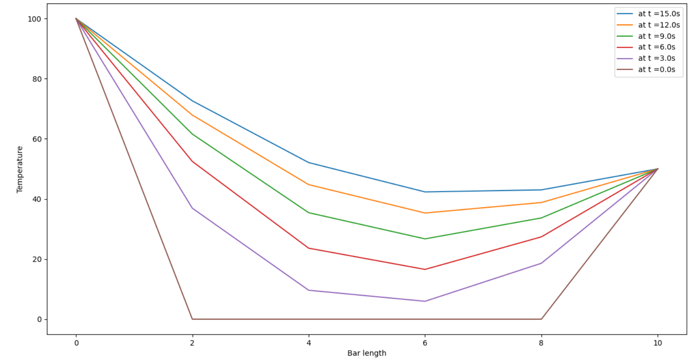

#Solving a 1D heat equation 
This program allows the user to choose the method by which the 1D heat equation will be solved.
The output shows the temperature of the rod at each node at the end of simulation time.
To visualize how the temperature distribution has changed over simulation time a plot is displayed
  